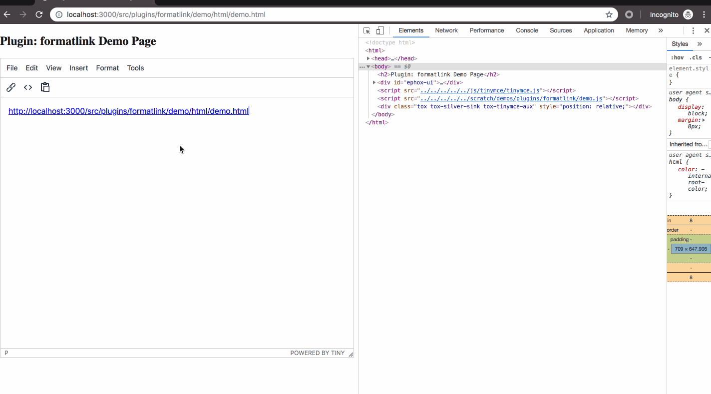

# Tinymce Plugin Formatlink

- add attributes to `a` tag


The plugin auto add `target="_blank"` and `rel="noopener noreferrer"` to `a` tag when press `enter` `space` or `Arrow Right`.

## Config

```js
tinymce.init({
  // ...
  plugins: 'formatlink',
  formatlink_attr_target: '_blank', // option, default: '_blank'
  formatlink_attr_rel: 'noopener noreferrer', // option, default: noopener noreferrer
});
```

## usage

Clone the project, and copy `formatlink` to tinymce plugins source code. Add `formatlink` to `Gruntfile.js`, build tinymce project.

### Clone prjects

```sh
$ git clone https://github.com/tinymce/tinymce.git
$ git clone https://github.com/nodejh/tinymce-plugin-formatlink.git
$ cp -r tinymce-plugin-formatlink/formatlink tinymce/modules/tinymce/src/plugins
```

### Change Grunt Config

Edit `tinymce/modules/tinymce/Gruntfile.js`:

```js
// ...
let plugins = [
  // ...
  'formatlink',
];
```

### Dev

```sh
$ yarn
$ yarn start
```

Then open browser and go to `http://localhost:3000/src/plugins/formatlink/demo/html/demo.html`.

## Demo




